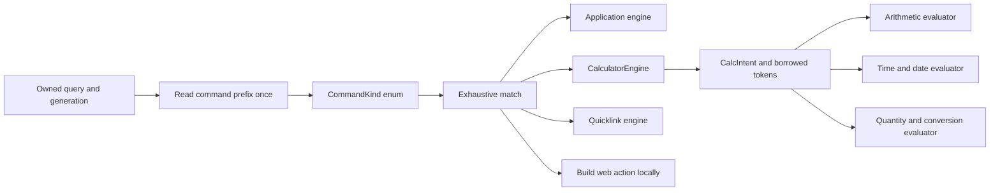

**Core v2 — construct choices, measured costs, and revised search design**

19 September 2026. Read this alongside the [main plan](C:/Users/Robert/code/Pleiades/Core/CORE_V2_PLAN.md). This review adds executable benchmark experiments; it does not implement or modify the old launcher.

**Follow-up available:** [Further Search experiments](C:/Users/Robert/code/Pleiades/Core/CORE_SEARCH_EXPERIMENTS.md) add complete matching, the supplied Search algorithm, compact indexes, allocation/build peaks, relevance and more parser/normalization alternatives. They supersede the provisional scan-only advice below. This document preserves its first timing snapshot; rerunning the expanded construct suite refreshed the raw CSVs with newer measurements. Use the follow-up and current CSVs for the latest figures.

**Adopt command token → enum → `match` → persistent feature engine. Spend the larger optimization effort on avoiding repeated parsing, allocations, filesystem calls and background work.** A construct is only the fastest for a specified workload and constraints. The measurements below support concrete defaults, not a claim that every line of the project has been proven optimal.

**What the project already does**

Current Core already has [QueryScope](C:/Users/Robert/code/Rust/core/src/command_router.rs:610), a [string-to-enum match](C:/Users/Robert/code/Rust/core/src/command_router.rs:671), and a [scope-to-provider match](C:/Users/Robert/code/Rust/core/src/command_router.rs:243). Your idea is therefore the right shape, but adding an enum alone would not improve this version.

Its [scope parser](C:/Users/Robert/code/Rust/core/src/command_router.rs:641) walks every whitespace token, accepts a scope embedded in the query, collects remaining words, lowercases tags and joins the body into a new string. Some UI classification helpers parse again. Calculator detection can even [evaluate the calculator](C:/Users/Robert/code/Rust/core/src/command_router.rs:521) just to decide which view to show. The calculator then [tries a sequence of handlers](C:/Users/Robert/code/Rust/core/src/calculator_dispatch.rs:6), with 25 regex-construction sites in its source. Not all 25 are executed for every input, but qualifying handlers compile patterns during evaluation.

That repeated work is the principal target. Changing a function into a class does not itself make the work cheaper.

**1. The proposed input and calculator design**

**Top-level parsing contract**

1. Receive one owned query for the worker. Parse the first command token into a small `CommandKind`; borrow the remaining body as `&str`. Carry generation and catalog/settings versions with the request. Borrowing is local to the request lifetime; references into an editable UI string must never escape across threads.
2. Treat built-in command names as ASCII and case-insensitive. Keep their mapping as a static string `match`. Preserve case, spaces and Unicode in the payload. A small ASCII stack buffer can normalize the command name; it must have a checked length limit. The prototype uses 16 bytes for its known aliases, not an arbitrary limit on user content.
3. Distinguish `Search`, `Command`, `CommandHints` and `InvalidInput`. `@`, `@cal`, unknown commands and an unfinished arithmetic expression must not execute anything. A command boundary is whitespace/end of input: `@calc2+2` is not `@calc 2+2`. Ordinary text and an email containing `@` remain ordinary search.
4. Recommend prefix-only commands for v2. Thus `@calc 2 + 2` is scoped, while `2 + 2 @calc` no longer has legacy scope semantics. This is a deliberate proposed grammar simplification, not a transparent performance fix. If embedded scopes must be retained, scan borrowed token spans and preserve the full grammar; do not use the prefix-only benchmark as the expected speedup for that implementation.
5. Dispatch the enum once with an exhaustive `match`. Keep user-defined aliases in a separate validated lookup table built when settings change; resolve them to typed targets with bounded expansion/cycle checks. Built-in dispatch needs no dynamically allocated provider object or map lookup on each keystroke.

The [runnable prototype](C:/Users/Robert/code/Pleiades/Core/benchmarks/constructs/src/routing.rs) implements the small prefix-parser experiment. Its `Option` return deliberately covers only benchmark needs; production code needs the distinct outcomes above. It preserves the old outputs only on the benchmark's shared input corpus.

**The Rust equivalent of your calculator class**

Use a persistent `CalculatorEngine` struct with methods. Construct it at application/feature initialization, not once per query. Compose it from arithmetic, duration, date/time and conversion modules; each module retains focused functions and tests. The struct coordinates them and owns reusable state. Do not move the present large calculator file wholesale into one enormous class.

| Piece | Responsibility and efficient representation |
| --- | --- |
| `CalculatorEngine` | Small coordinator; immutable unit metadata, compiled patterns and parsed locale/timezone configuration. Use concrete fields and method calls for built-ins. |
| `CalcContext` | Capture one clock instant per request and borrow the relevant locale/configuration. Avoid cloning all launcher settings or caching “now” for one second. |
| `CalcIntent` | Arithmetic, duration, date/time, quantity conversion, or ambiguity. A cheap lexical classifier chooses a small bounded set of candidate evaluators. Classification itself never evaluates, reads data or performs I/O. |
| Domain tokens | Numbers, operators, units and keywords carry typed values or byte spans into the owned payload. Do not construct a `String` per token. Preserve enough information for precise errors. |
| Evaluation outcome | Distinguish value, incomplete input, invalid input and ambiguous alternatives. Only explicit user selection produces an action. |

`2+2`, `1h + 30m`, `2pm pt to uk`, and `5 km to mi` share an entry point, but not one grammar. A complete lexer is useful inside an expression language; tokenizing all text into an allocated vector before identifying `@calc` is unnecessary. Explicit optional subcommands such as `@calc time ...` can resolve ambiguity while automatic intent selection remains available.

For first-release arithmetic, retain `meval` if it passes correctness and latency gates. A bounded Pratt parser or shunting-yard evaluator is a candidate when unit-aware expressions justify it, not an automatic replacement. Limit input size, token count and nesting; a proposed starting envelope is 4 KiB, 256 tokens and 32 nesting levels, with typed errors at the limits. Those are proposed product limits, not current behaviour.

Precompile any retained constant regex once, preferably lazily per feature. Reusing a compiled regex was a large win in the experiment below. It does retain compiled state, so cold initialization and retained memory must be measured separately; precompiling every future grammar at startup is unnecessary. [The regex crate's guidance](https://docs.rs/regex/1.12.3/regex/#avoid-re-compiling-regexes-especially-in-a-loop) also recommends avoiding repeated compilation.

Future unit support should use canonical unit IDs and dimensional rules. Temperature offsets, calendar months, daylight-saving gaps/folds and ambiguous abbreviations require explicit semantics. Preserve established Unicode and timezone-library behaviour. Live exchange rates would be a separate snapshot/provider with an age label, never a blocking fetch inside local calculation. These extensions remain outside the small first release.

Concrete struct methods and free functions can both be inlined. A trait used through generics can also dispatch statically. `&dyn Trait` uses runtime indirection but does not inherently allocate; `Box<dyn Trait>` adds ownership/allocation when constructed. Dynamic dispatch is reasonable for genuine extensibility or cold boundaries, but adds no value to four known built-ins. [Rust trait-object reference](https://doc.rust-lang.org/reference/types/trait-object.html)

**2. Actual local benchmark results**

Machine: AMD Ryzen 7 7800X3D, 16 logical processors, Windows build 26200. Rust 1.95.0, x86-64 MSVC, release optimization level 3, thin LTO, one codegen unit. Regex and its four transitive dependencies match the old project's lockfile versions. Three sequential process runs, 31 timed batches per case. Input/output uses `black_box`; tests check the compared outputs where semantics overlap. [Rust's benchmarking caveat](https://doc.rust-lang.org/std/hint/fn.black_box.html) applies: optimization barriers are best-effort.

Numbers below are **medians of three run medians of per-operation batch averages**. They are not p95 individual-query latency. These desktop runs were not isolated or CPU-affinity-pinned. Allocation counting was performed separately after timing. “Bytes requested” means cumulative allocator traffic, including reallocations, **not peak RAM, retained memory or working set**. Zero per-operation allocations excludes setup and any retained caches/compiled patterns.

| Construct and workload | Previous or standard alternative | Proposed/tested alternative | Observed timing | Allocation calls/op, before → after |
| --- | --- | --- | --- | --- |
| Scope parsing, ten rotating common queries | Extracted current parser | Prefix-only borrowed parser | 135.27 ns → 15.70 ns, about 8.6× | 3.5 average → 0 |
| Built-in alias lookup, 20 aliases | Prebuilt standard `HashMap` | Static string `match` | 10.19 ns → 2.36 ns, about 4.3× | 0 → 0 |
| Same alias lookup | Static linear table | Static string `match` | 3.07 ns → 2.36 ns | 0 → 0 |
| Already-normalized ASCII query | Existing cache hit returning a cloned string | Borrow input with Unicode fallback | 41.82 ns → 14.42 ns | 1 → 0 |
| Normalization over 512 changing keys | Existing 256-entry global cache | Original algorithm without that cache | 316.78 ns → 99.74 ns | 6 → 3 |
| One named-day regex predicate | Compile pattern and match on every call | Match with the same precompiled pattern | 249.16 µs → 0.01975 µs | 1,937 → 0 |
| Best 12 of 2,000 pre-scored mixed candidates | Current helper with cloned comparison keys | Partial selection with borrowed comparison keys | 222.94 µs → 4.40 µs, about 51× | 9,044 → 1 |

**Interpretation:** the parser change saves roughly 0.12 microseconds in this corpus. The single regex experiment avoids roughly 249 microseconds. Removing the existing 28 ms local-search debounce removes a much larger intentional delay, although actual end-to-end improvement still depends on scheduling/rendering. Do not add benchmark ratios together or call them a whole-launcher speedup.

The parser comparison also changes grammar and supported command breadth. The regex comparison measures only `is_match` on a warmed compiled pattern; full tokenization, captures, clock logic and arithmetic are excluded. The rank comparison changes allocation/data representation as well as selection mechanics. These distinctions prevent attributing every gain to `enum`, `match`, or a particular collection.

**Top-result selection: fastest depends on candidate order**

All variants below retain 12 results from the same pre-scored synthetic candidates. Name matching, index construction, UI and disk I/O are excluded. Times are microseconds per operation; small differences can be affected by desktop noise.

| Strategy | 2,000 mixed | 2,000 best first | 2,000 worst first | 50,000 mixed | 150,000 mixed |
| --- | ---: | ---: | ---: | ---: | ---: |
| Current helper, cloned keys | 222.94 | 260.56 | 195.21 | 5,739.30 | 16,617.20 |
| Full sort, borrowed keys | 40.82 | 6.11 | 6.19 | 3,146.85 | 11,778.25 |
| Partial selection, borrowed keys | 4.40 | 4.66 | 3.51 | 125.25 | 587.55 |
| Bounded heap | 2.58 | 2.64 | 40.45 | 50.40 | 147.00 |
| Fixed sorted buffer | 3.29 | 2.03 | 69.04 | 38.55 | 108.90 |

The old helper already uses partial selection. Its avoidable cost includes creating owned string comparison keys even when scores differ. The proposed comparator short-circuits score comparisons and borrows names. Standard-library partial selection avoids a full sort; a heap bounds retained candidates but has different update costs. [Rust slice selection](https://doc.rust-lang.org/std/primitive.slice.html#method.select_nth_unstable_by), [Rust heap documentation](https://doc.rust-lang.org/std/collections/binary_heap/index.html)

For the small application catalog, **choose borrowed partial selection with reusable scratch storage** as the default: predictable behaviour and a tiny memory cost. The heap's approximately 1.8 µs mixed-case advantage is not worth assuming it wins across query distributions. The experiment allocates a fresh vector; scratch reuse is a planned additional reduction, not included in those measured timings. When at most 12 candidates match, simply sort that small slice.

For a future large file catalog, consider a bounded heap or fixed buffer after benchmarking real matching, broad queries and worst arrival order. These 50k/150k figures are selection kernels, not evidence of complete file-search latency. A filename candidate index may matter more than which top-k container follows it.

| Ranking allocation traffic | 2,000 candidates | 150,000 candidates | Additional note |
| --- | ---: | ---: | --- |
| Current helper | 228,084 bytes/op | 18,348,340 bytes/op | Many temporary string allocations and vector growth. Not simultaneously resident memory. |
| Borrowed partial selection | 16,000 bytes/op | 1,200,000 bytes/op | One `usize` index per candidate in this prototype; reusable capacity can amortize allocation. |
| Bounded heap | 384 bytes/op | 384 bytes/op | Twelve tuples containing score, borrowed name and index. Setup/catalog strings excluded. |
| Fixed buffer | 96 bytes/op | 96 bytes/op | Output vector only; also uses a 96-byte stack array for retained indices. |

For only eight candidates, borrowed partial selection's small-sort path measured 40.92 ns versus 103.90 ns for the heap. This is another reason not to force every search through a heap.

The isolated named-day regex compiled 680,228 cumulative requested bytes per operation versus zero for its warmed predicate. That does **not** mean a compiled regex permanently occupies 680 KiB; temporary compiler allocations are counted repeatedly and the warmed object exists outside the counting interval.

Raw data: [aggregate CSV](C:/Users/Robert/code/Pleiades/Core/benchmarks/constructs/results/summary.csv), [environment](C:/Users/Robert/code/Pleiades/Core/benchmarks/constructs/results/environment.json), [benchmark methodology and reproduction](C:/Users/Robert/code/Pleiades/Core/benchmarks/constructs/README.md). Nine tests pass in debug and release; formatting and Clippy checks pass for the harness. The old application itself was not built or benchmarked.

**3. Project-wide construct audit and decisions**

The review inventories all 61 Rust source files under `src` (approximately 26,500 lines), plus shared types, manifests, the old benchmark and build/installer entry points. It traces routing, calculator, ranking, UI event/render paths and storage in detail, and reviews the remaining features' entry points and expensive construct sites. This is a project-wide performance-design review, not a line-by-line formal correctness proof or whole-process profile. [Per-file inventory](C:/Users/Robert/code/Pleiades/Core/benchmarks/constructs/results/project-inventory.csv)

| Area | Current construct or cost | Preferred v2 construct and priority |
| --- | --- | --- |
| Routing and feature selection | Enum dispatch already exists; repeated parsing and broad unscoped provider fan-out. | One parsed request, explicit enums, fixed built-in dispatch, cheap intent recognition. High priority. |
| Calculator and timezone resolver | Repeated regex compilation; sequential probes; settings copies; timezone fallback normalizes names while scanning the full timezone set. | Persistent composed engine, lazily compiled grammar, borrowed context, pre-normalized timezone lookup built once if that feature is restored. High priority for active math; other domains deferred. |
| App/file ranking and text normalization | Temporary comparison strings; global normalization mutex/cache; file scan scales with catalog. | Precompute catalog keys, normalize once, borrowed comparator, reuse scratch. Keep a contiguous catalog for a few thousand apps. File-scale candidate indexing is a separate future choice. |
| Launcher and service boundary | Debounce then synchronous router execution; synchronous action/persistence paths; multiple view/classification booleans. | One replaceable worker request, typed view state, versioned result batches and explicit actions. A struct alone does not guarantee this separation. |
| UI icons and assets | [Rendering](C:/Users/Robert/code/Rust/core/src/ui/lucide_icons.rs:129) calls [icon-path generation](C:/Users/Robert/code/Rust/core/src/ui/lucide_icons.rs:178), which checks filesystem existence and may read/tint/write SVGs. App discovery extracts icons eagerly. | Preloaded/in-memory handles for bundled icons; lazy background extraction for app icons. Render from ready data. High priority. |
| Text input, text area and markdown UI | Whole-string replacement and Unicode/UTF-16 boundary scans; larger note UI belongs to a deferred feature. | Retain correct IME/grapheme handling. A small bounded launcher string does not justify a rope or a custom byte-index editor. Create note/settings entities only when needed. |
| Hotkeys, tray, activation and platform windows | Native message-loop support exists, but UI delivery polls channels; focus has both observation and polling. | Event bridge into the UI, no recurring delivery polls. Keep Windows handles behind adapters and preserve thread/COM requirements. High priority. |
| Settings, usage, snippets, quicklinks and calendar | Repeated store loads/reconstruction, direct file rewrites, usage recorded before action success. | Loaded state, change-triggered lookup rebuilds, single writer, atomic recoverable persistence. Keep only initial-release stores active. |
| Notes and focus | Notes scan/read files; [note search](C:/Users/Robert/code/Rust/core/src/notes.rs:27) also triggers retention deletion. Focus checks persisted state from a timer. | Search must be read-only over prepared state. Retention is an explicit maintenance job; a focus deadline is a one-shot event. Features deferred. |
| Clipboard | Cached store is still metadata-checked and cloned; two additional regex-construction sites classify content. | If restored: change notifications, capped history, in-memory snapshot, compiled classifiers, explicit privacy rules. No clipboard service in v1. |
| Terminal and process/media tools | Unbounded terminal event channel, line-based allocation, UI poll; output list uses front-drain; process/media probes start PowerShell. | If restored: bounded byte/chunk transport, output byte/line cap, ring buffer, drain budget and explicit process lifecycle. Use direct OS APIs where suitable. Never block UI on child output. |
| Git/GitHub/package/network/lookup/screenshot tools | Scoped action builders coexist with synchronous network/process-backed search paths. | Explicit activation, cached snapshots where justified, bounded I/O timeouts, cancellation and separate execution. Omit from first release. |
| Emoji, colour, developer tools and context actions | Mostly small local transforms/catalogs but invoked through broad routing; repeated normalization and result construction. | Static metadata and exact triggers; allocate display results only after selection. Keep useful pure functions when features return; optimizing disabled features provides no v1 benefit. |
| Shared command types, paths and credential adapter | Typed enums are a useful foundation; result objects repeat strings; some fixed states remain text. | Small result IDs and typed actions, references to immutable catalog data, minimal context. Keep credential handling behind the OS adapter; do not cache secrets for a supposed speed gain. |
| Packaging and dependency boundary | Single app crate exports broad feature modules; build script consumes an existing release executable when constructing the installer payload. | Keep engine independent of GPUI and optional features; package from an explicit verified app artifact. Benchmark release flags; do not assume smaller binaries mean lower runtime RAM. |

Two correctness concerns discovered during this pass should be tracked separately from speed: note search can delete expired notes through maintenance side effects, and the build script's path guard uses a plain string prefix rather than a path-component boundary. The latter can accept a similarly prefixed sibling if reused with such an input; the current computed build paths were not shown to exploit it. Neither source was changed.

**4. Resource and latency forecasts still requiring integration measurements**

| Change | Quantifiable effect now | Expected/target effect to test later |
| --- | --- | --- |
| Remove 28 ms default debounce | Removes 28 ms of intentional waiting once the final key is received. | Proposed complete local query-to-display p95 ≤35 ms, subject to scheduling and refresh rate. |
| Replace 40 ms hotkey polling | For uniformly phased arrivals, polling alone contributes an analytical mean of 20 ms and p95 of 38 ms. These are a model, not measured event latencies. | Hotkey-to-presented-frame p95 ≤50 ms, p99 ≤100 ms. A notification does not imply zero latency. |
| Remove periodic feature loops | Existing nominal intervals sum to about 57 timer iterations/second including media, if work time is ignored. OS wakeups can coalesce and work extends intervals. | No application-owned recurring idle polling; mean hidden CPU ≤0.1% of one logical CPU after settling. No forecasted percentage saving without an old-process baseline. |
| Use one latest-query slot | Pending query storage becomes bounded instead of proportional to an arrival backlog. | At most one running and one pending search, plus bounded result publication. A 4 KiB query cap means at most roughly 8 KiB of query text for those two jobs, excluding UI copies/overhead. |
| Catalog IDs and shared immutable snapshots | Avoid copying catalog strings into every result or request. Small v1 ranking scratch is ~16 KiB in the measured `usize` prototype. | Retain at most current and in-flight old snapshots; measure peak during refresh. `Arc` shares ownership but does not copy the payload, and uses atomic reference counting. [Rust Arc documentation](https://doc.rust-lang.org/std/sync/struct.Arc.html) |
| Lazy bounded icon decoding | A 32×32 RGBA image has 4 KiB of raw pixels; 2,000 such images alone are about 7.8 MiB. Eight visible ones contain 32 KiB before overhead. | Keep the proposed 8 MiB decoded-cache ceiling; GPU textures, DPI variants, metadata and allocator overhead must be measured separately. |
| Precomputed calculator state | Removes recurring regex compilation and repeated settings parsing/copies. | Proposed local arithmetic evaluation p95 ≤100 µs after warm-up; richer local time/unit evaluation ≤500 µs when introduced. These are budgets, not timings established by the one-regex test. |
| Narrow startup and module scope | Deferred providers start no threads, reads, timers or processes. | Hidden private bytes ≤50 MiB, visible ≤75 MiB and cached startup ≤500 ms remain unverified application targets. |

For end-to-end search, budget ≤1 ms for request parsing/ranking/evaluation on the reference small corpus as an engineering objective, with the original ≤5 ms engine p95 as the initial acceptance ceiling. The microbenchmarks leave room for scoring, ownership, cancellation checks and result formatting but do not measure them together. OS scheduling and display presentation consume additional time; they must be traced separately.

A temporary `String` is not inherently bad. Allocating one request and a few final visible labels is reasonable. Avoid allocating for every candidate/comparison, retaining every old request, or doing unrelated work at every keypress.

**5. Choices to resist until evidence justifies them**

| Tempting change | Why it is not the default |
| --- | --- |
| HashMap/perfect hash for every built-in keyword | Static `match` won the small fixed lookup experiment. Runtime alias catalogs may justify a map; hash-table setup/memory was not part of lookup timing. Compiler lowering of `match` is not guaranteed to be a jump table. |
| One trait object/task/thread per provider | Adds scheduling and ownership complexity to a tiny built-in set. Use static dispatch and one search worker; reserve dynamic boundaries for genuine optional providers. |
| Lock-free structures everywhere | A tiny latest-request slot with a short mutex/condition-variable critical section is a simpler starting point. Keep search and I/O outside locks; measure contention before introducing atomic protocols. |
| Trie, SIMD, full token arena or custom allocator immediately | For 2,000 apps, the measured selection work is already in microseconds. These have memory, portability and maintenance trade-offs and require full matching profiles to justify. |
| “Always stack”, “always inline”, or `unsafe` for speed | Large stack buffers, code-size growth and broken UTF-8/IME boundaries can make performance or correctness worse. The benchmark allocator wrapper is instrumentation, not a recommendation for production unsafe code. |

**Implementation sequence and effort**

| Step | Deliverable | Planning effort |
| --- | --- | --- |
| 1 | Finalize command grammar; carry one typed request; reuse this parser corpus and add alias/unknown/incomplete-state tests. | 0.5–1 day |
| 2 | Compose the arithmetic engine; stop full evaluation during classification; reuse patterns and borrow only necessary context. | 1–2 days for first-release arithmetic |
| 3 | Replace allocating ranking comparisons; reuse scratch; establish end-to-end matching/relevance fixtures. | 0.5–1 day |
| 4 | Integrate latest-request scheduling, stale-result rejection and allocation/latency traces. | 1–2 days, overlapping existing engine work |
| 5 | Profile the real shell, eliminate render-path I/O and polling, then enforce process CPU/RAM/presentation gates. | Covered by the existing shell and integration milestones; framework fallback is additional |

These tasks refine the original engine milestone rather than create a separate rewrite. Expanding arithmetic into reliable time/date/unit languages is a later scope item: provision roughly 5–10 additional engineering days for implementation and boundary tests, depending on how much existing behaviour can be retained. Calendar ambiguity and correctness, not the `match` statement, drive that estimate.

**Implementation entry point:** the main plan's measured minimal shell remains milestone A. In the pure engine work, encode prefix-only grammar and incomplete/unknown states, then integrate the updated candidate index, reused selection storage and composed calculator. The small-release scope and framework memory experiment remain in force; consult the follow-up for the final construct choices.
