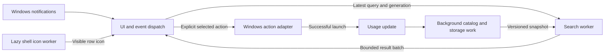

**Core v2 — a small, fast Windows launcher**

Implementation started · 19 September 2026 · The native launcher and pure engine are now working. See the [current feature/performance comparison](docs/FEATURE_AND_PERFORMANCE_DIFF.md), [initial implementation status](docs/IMPLEMENTATION_STATUS.md) and [run instructions](README.md). This document retains the full release scope and acceptance gates; several features and gates remain pending. Time conversion was subsequently added at the user's request despite its original deferral below.

The [construct review](C:/Users/Robert/code/Pleiades/Core/CORE_CONSTRUCT_REVIEW.md) and [further Search experiments](C:/Users/Robert/code/Pleiades/Core/CORE_SEARCH_EXPERIMENTS.md) refine this plan: parse command prefixes once into an enum, dispatch to composed feature engines, precompile retained calculator patterns, and combine prepared candidate indexes with reused partial selection. The follow-up compares the supplied Search repository, complete matching, memory/build costs, relevance and further parser alternatives; its measured decisions supersede earlier provisional scan-only advice.

**Start with a measured launcher shell, then add only features that fit its performance budget.** Your priorities are lowest CPU/RAM, fastest search, and a smaller first release. The recommendation is a fresh, tightly scoped application in this folder, selectively reusing tested logic from `C:\Users\Robert\code\Rust\core`.

This is an architecture and delivery plan, not a claim that the proposed performance has already been achieved. The [source audit](C:/Users/Robert/code/Pleiades/Core/CURRENT_CORE_AUDIT.md) identifies the current code paths behind these decisions. The existing project and its uncommitted work remain untouched.

**1. Define the product boundary**

Core should do one job: press a hotkey, type a short query, choose a result, and return to work. The first release contains five capabilities:

| Capability | First-release behaviour |
| --- | --- |
| Application launching | Search Start Menu applications and supported packaged applications; open the selected target through Windows. Resolve launch targets separately from their display names. |
| Basic calculator | Local arithmetic, parentheses, and percentages; copy on Enter. Reuse verified parsing behaviour and test cases. Units, dates, timezones, currency and market data are deferred. |
| Quicklinks and web search | Saved URL/path shortcuts and explicit web searches. Retain familiar `>keyword`, `@app`, `@calc`, and `@web` entry points. Encode query parameters correctly. No remote autocomplete. |
| Favourites and recent launches | An immediately available home list; stable matching and optional local usage history. Store launch identifiers and counts, not arbitrary queries or copied calculation values. |
| Essential settings | Hotkey, launch at login, theme, quicklink management, and history clear/disable. Settings controls are constructed only when opened. Startup registration changes only when the preference changes. |

File indexing, clipboard history, notes, snippets, focus sessions, calendar, embedded terminal, media, system/window controls, developer/network tools and plugins are outside this release. Their workers, timers, dependencies and initialization code must also be absent. Existing data remains available to the old application.

Preserve the familiar keyboard flow and visual language where practical. Use one search field, up to eight visible rows, and a small footer. Show loading, no-result and launch-error states in place. Avoid preview panels, continuous animation and background media widgets. Blur starts disabled. Build only the small settings surface this scope needs.

**2. Set performance gates before choosing the final shell**

These are initial acceptance targets, to be ratified against recorded hardware during the first milestone. If a target fails, publish the result and revise the implementation or explicitly revisit the target; do not quietly redefine the measurement.

| Measurement | Proposed gate | Conditions |
| --- | --- | --- |
| Hidden idle CPU | At most 0.1% of one logical CPU on average | Ten minutes after indexing and pending saves finish; calculate `100 × process CPU seconds / elapsed seconds`. Include any helper processes. |
| Hidden memory | At most 50 MiB private bytes | Warm process, 2,000 launch targets, 200 quicklinks, 100 usage records, window hidden for 60 seconds after use. Record working set and GPU memory separately. |
| Visible memory | At most 75 MiB private bytes | Same dataset, eight rows, ordinary typing. Report peak during catalog replacement as well. |
| Hotkey to visible, focused input | p95 at most 50 ms; p99 at most 100 ms | Already running and hidden; measure through the first presented frame, not merely the hotkey callback. |
| Keystroke to correct displayed results | p95 at most 35 ms; p99 at most 70 ms | Include scheduling, ranking, layout and presentation at 60 Hz. |
| Search engine only | p95 at most 5 ms; p99 at most 10 ms | Changing queries over the reference dataset; no disk access or cache-hit-only benchmark. |
| Startup to hotkey-ready shell | p95 at most 500 ms | New process with a valid catalog cache; report first-ever discovery separately. |
| Idle work | No periodic application polling or steady disk writes | OS notifications and sleeping workers are allowed. Dirty-state saves and bounded recovery work are measured separately. |

Measure the old default application and an old configuration matching the new scope, where possible. This separates savings from feature removal from savings due to architecture. Record OS build, CPU, memory, storage, GPU/driver, display scale, power mode, source revision and release-build settings. Do not compare debug builds with release builds.

Use at least 1,000 changing query samples and 200 hotkey activations across several runs; report p50/p95/p99, sample counts and worst cases. Use 30 fresh-process launches for startup and identify warm filesystem-cache runs separately from genuinely cold runs. Include rapid typing, backspace, no matches, broad matches, Unicode, long paths and repeated open/close. A ten-minute idle capture and a 1,000-cycle open/search/hide stress test cover persistent work and resource growth. After warm-up, retained private bytes should settle within 5 MiB of the earlier idle reading, with no increasing OS/GPU handle trend.

GPU allocations are not hidden inside a RAM success claim: report dedicated/shared GPU usage alongside process memory. Investigate sustained hidden GPU activity. Use Windows performance traces when available; otherwise record the unavailable metric rather than substitute an engine timer for end-to-end latency.

**3. Choose a deliberately small architecture**

**Selected first implementation: Rust, native Win32 controls, and direct Windows services behind adapters.** The pinned minimal GPUI probe retained approximately 64.9 MiB private bytes while hidden; the initial native control probe retained approximately 1.24 MiB. The native fallback below was selected to preserve memory headroom. GPUI remains an optional probe, excluded from the default launcher binary. Detailed conditions and current build measurements are in the implementation status.

Run a two-to-three-day shell experiment first: input, eight static rows, hotkey, tray, hide/show and correct text input. Profile it before porting features. Retain GPUI only if the minimal shell leaves useful headroom inside the 50 MiB hidden-memory budget and passes focus, DPI, IME and accessibility checks. Verify the event-dispatch bridge against the pinned revision, not just current upstream examples.

If the framework is the measured limiting factor after application polling is removed, compare one equivalent Win32/DirectWrite prototype. A native shell is an alternative with more text-input, accessibility and rendering maintenance; it is not assumed to be faster. Select one shell before feature implementation. Budget this fallback separately instead of building two production UIs.

Use a single process and two workspace crates. This keeps the engine testable without compiling the GUI while avoiding a crate for every feature.

```text
Core/
  Cargo.toml
  rust-toolchain.toml
  crates/
    launcher/                         # Application composition and adapters
      src/
        main.rs
        app.rs
        launcher/                    # Search field, results, view state
        settings/                    # Settings page and save workflow
        windows/                     # Hotkey, tray, activation, shell, clipboard write
        storage/                     # Settings, usage, catalog cache, importer
    engine/                          # No GPUI, filesystem, network or Windows imports
      src/
        lib.rs
        search/                      # Parse query, select providers, rank results
        applications/                # Catalog and matching
        calculator/                  # Pure evaluation and typed errors
        quicklinks/                  # Validate and resolve saved targets
        usage/                       # Ranking signals and recent item rules
      benches/
  tests/                             # Process/platform integration scenarios
  docs/
  scripts/                           # Build and measurement entry points
```

Each use case has a focused file, such as `search/execute_search.rs`, `applications/rank_applications.rs`, or `storage/import_legacy_settings.rs`. Public module exports stay small. Related types live with their feature; only query IDs, result IDs and the few shared actions belong in shared contracts.



The UI owns focus, text input and selection. The engine owns query interpretation and ranking. Platform adapters own Windows handles and side effects. Storage owns persistence and migrations. Search never launches a process, reads a file, fetches a URL or mutates user data.

**Execution and lifecycle rules**

1. Use Windows hotkey/tray/activation notifications to wake the UI. `RegisterHotKey` delivers `WM_HOTKEY`; handle registration failure and offer an alternate binding. A sleeping event bridge is acceptable when the chosen UI integration needs one. It must wake the UI through supported dispatch, not inspect a channel every 40 ms. [Microsoft hotkey documentation](https://learn.microsoft.com/en-us/windows/win32/api/winuser/nf-winuser-registerhotkey)
2. Use one search worker with a replaceable pending-query slot. A newer query cancels obsolete work cooperatively. Jobs carry query generation and catalog/settings versions; the UI discards mismatched batches. Increment the generation on clear, hide and mode changes as well as typing.
3. Use one background I/O worker for catalog refresh and persistence. Break discovery into bounded batches so settings saves can run. Publish immutable snapshots; search never waits for a directory scan or holds a lock across filesystem access. Coalesce repeated refresh requests and retain only bounded generations.
4. Extract icons lazily on a separate, bounded shell worker, initialized for the required COM apartment. This prevents a slow shell extension from occupying search or storage. Request only visible icons and small lookahead; show a placeholder immediately. A cancelled native call may still finish, so ignore obsolete results and cap outstanding calls rather than claim forced thread cancellation.
5. While hidden, cancel presentation-only work and render nothing until an event requires it. Workers block when idle. On exit, stop accepting jobs, unregister notifications, cancel outstanding I/O, release native handles and finish pending durable saves within a defined timeout. The total thread count includes framework threads and is recorded, not assumed to equal these application workers.

**4. Make search fast and predictable**

Normalize each query once while preserving its original spelling. Precompute matching strings and word boundaries when the catalog changes. Keep Windows launch identifiers/path data distinct from the strings used for search; do not normalize the actual launch target through lossy display text.

Parse the proposed prefix-only command grammar into a `CommandKind` enum and dispatch once with an exhaustive `match`. Borrow the payload from the worker's owned query and distinguish ordinary search, incomplete scope, unknown command and invalid input. This intentionally simplifies the old embedded-scope grammar; the construct review documents the compatibility trade-off. Use a small fixed provider list. Recognizable arithmetic activates a persistent, composed `CalculatorEngine`; ordinary text searches applications and quicklinks. Classification does not evaluate the calculator. Web search is a locally constructed action and contacts the browser only after selection. No generic plugin system or speculative provider fan-out is needed.

Use a contiguous immutable in-memory catalog. A scan remains the reference implementation and the lowest-storage option for tiny catalogs. The further experiments justify testing a small flat trigram index for larger app catalogs: borrow the rarest posting, reject missing required grams immediately, and verify complete words/strings. The measured 2,000-name flat index retained about 0.20 MiB and built in 0.87 ms. A proposed 128-entry threshold and 512 KiB posting budget are resource policies to validate on installed-app catalogs, not universal crossover points. Build the index only when catalog data changes; normalize indexed names and queries identically.

Select the best 12 eligible candidates using borrowed comparisons or prepared ordinals and partial selection in reusable scratch storage; sort directly when at most 12 match. Construct display strings only for final results. The earlier 16 KiB estimate described 2,000 `usize` IDs; typed scored candidates use a different layout and their actual retained capacity must be measured. For a future large file catalog, compact hash postings and a bounded heap are the leading measured candidates. Do not transfer Search's directory graph, watcher processing, database writes or whole-index fallback into the query path.

Rank with a documented tuple: explicit intent, match class, bounded usage preference, canonical display-name order, then stable result ID. Match classes are exact, prefix, word-prefix/acronym and substring. Pins and frequency break ties inside a match class; they cannot push a weak match above an exact match. Add typo tolerance only when relevance fixtures and latency measurements justify it.

Maintain an independent initials/alias candidate path; exact trigrams must not exclude abbreviation or typo results. The new fixture supports initials plus a bounded late typo fallback, but its 20 authored intents do not establish general relevance. Preserve the ranking tuple above: the measured alphabetical prefix early-exit is invalid with usage-based ordering unless a separate ranking-aware index proves it returns the same top results. Incremental narrowing must retain all previous matches and reset on incompatible edits or catalog changes; it remains unnecessary for the initial small catalog.

Examples that must remain predictable:

| Query or interaction | Required behaviour |
| --- | --- |
| `code` | A configured exact alias wins; otherwise deterministic app/quicklink matching. |
| `vsc` | A matching application acronym can find Visual Studio Code. |
| `2 + 2` | Calculator result `4`, available locally; Enter copies it. |
| `>docs` or `@web rust & windows` | Resolve a saved shortcut or correctly encoded browser search action. |
| Type a new query, immediately press Enter | Never launch a result left over from the previous query. Queue acceptance for the current generation or wait for its result. |

Do not debounce the initial local providers. Search begins immediately off the UI thread. A generation check alone prevents stale display; cooperative cancellation and the replaceable queue also prevent obsolete work from accumulating. Keep selection by stable result ID during asynchronous updates. If the selected ID disappears, apply an explicit fallback rule and never execute an invisible previous selection.

Start without a search-result cache. The old 150 ms repeated-query cache does not accelerate normal changing keystrokes. If profiling later supports a cache, include catalog/settings/usage versions and relevant clock context in its key. Cache size must be bounded.

Normalize once per request: borrow canonical ASCII, otherwise use worker-owned reusable storage for ASCII changes, preserving the existing whole-string Unicode semantics on the fallback path. The benchmark now covers every ASCII byte, including vertical-tab whitespace. Keep constant calculator regexes compiled per active feature instead of rebuilding them per query. The calculator struct owns only relevant reusable state; its arithmetic, time/date and conversion logic remains in separate modules. Later capability expansion does not require a monolithic calculator class or a heap allocation for every token.

**Catalog, icons and storage**

Show the shell and register its hotkey before app discovery. Load a small, versioned app-catalog cache in the background, then reconcile with the Start Menu and packaged-app catalog. During first-run discovery show a truthful loading state and publish complete batches. Preserve distinct applications with identical display names; deduplicate by launch identity. Revalidate failures when a cached target has been removed.

For Start Menu folders, subscribe before enumerating, buffer/coalesce changes, reconcile the initial scan and then process updates. Folder-change notifications can overflow; mark the affected root dirty and re-enumerate it. Reconcile after resume, and provide manual refresh. Packaged-app discovery and refresh need their own verified adapter; Start Menu watching alone is not proof of packaged-app coverage. [Microsoft directory notification documentation](https://learn.microsoft.com/en-us/windows/win32/api/winbase/nf-winbase-readdirectorychangesw)

Bundled UI icons must also render from ready in-memory handles: no filesystem existence checks or SVG tint/write operations during rendering. Search is read-only; future note retention belongs in maintenance, never a query handler.

Keep configuration/quicklinks in versioned TOML, usage metadata in a small versioned store, and the rebuildable app cache separately. Use existing `serde`, `toml` and `serde_json` dependencies where appropriate. A database is unnecessary for the initial catalog. Store mutable user data under `%APPDATA%\Pleiades\Core`; put rebuildable cache data under `%LOCALAPPDATA%\Pleiades\Core`.

Load stores once and update memory after validated changes. Use a single writer and a tested Windows-safe temporary-file/replace procedure with backups. Explicit settings and pin changes report success only after durable save; usage counts can be coalesced with a one-shot dirty-state timer and a maximum one-second loss window on a crash. Missing files, parse errors and permission failures are separate outcomes. Preserve unreadable/corrupt files and show an actionable message; never overwrite them silently with defaults.

Start with an 8 MiB decoded icon-cache limit, at most 2 MiB of retained catalog-cache data for the reference dataset, and at most 100 usage records. Measure real allocations and shared/GPU resources. Key icons by launch identity, source version, size and display scale. Bound the disk cache as well. Clear generation-specific results and obsolete snapshots promptly.

The UI stores `ResultId`, display data and a typed action such as launch application, open saved target or copy calculation. The executor validates the action boundary and uses Windows APIs with structured arguments. Arbitrary shell commands are deferred. Surface execution failure in the launcher; record successful dispatch rather than treating every Enter press as a successful launch. Search itself has no external effects.

**5. Deliver in measured increments**

These are planning estimates for one developer working focused engineering days, not elapsed-time promises. A usable alpha is approximately 10–16 days; a hardened first release is approximately 15–25 days. A native-shell fallback or substantial packaged-app/accessibility work adds time.

| Milestone | Estimate | Deliverable and exit gate |
| --- | --- | --- |
| A. Baseline and shell experiment | 2–3 days | Record old-app baseline; repair or replace the stale benchmark in an isolated development copy; measure the minimal shell. Decide GPUI against memory, activation and input/accessibility gates. |
| B. Search engine | 3–5 days | Typed queries/actions, stable IDs, deterministic matching, calculator/quicklink providers and latest-query scheduling. Pure engine tests and changing-query latency gate pass. |
| C. Usable launcher alpha | 5–8 days | Real application discovery, Windows launch adapter, lazy icons, favourites/recents, essential settings, hotkey/tray and stable selection. Measure full input-to-presentation latency and idle footprint. |
| D. Persistence and migration | 2–4 days | Atomic save/recovery, versioned cache, directory-change recovery, one-time supported-data import and separate install identity. Failure and restart scenarios pass. |
| E. Release hardening | 3–5 days | Soak/performance runs, multi-monitor/DPI/IME/accessibility checks, sleep/resume, installer/update/uninstall tests and a published before/after report. Release only when gates pass. |

The native alternative is a contingency after milestone A, not an extra framework commitment. Installation is per-user, with a single-instance guard and explicit hotkey-conflict handling. Keep the old installer identity, startup entry and data separate during the pilot. Ensure both versions cannot silently compete for the same hotkey.

**Migration and rollback**

Offer a one-time import with a preview: hotkey, startup preference, quicklinks, supported aliases, pins and valid application usage records. Reject conflicting shortcuts, unsupported alias scopes and malformed targets with a clear report. Match old usage to new stable IDs; skip unresolved entries. Importing an enabled startup preference must not register a second startup instance before the user switches over.

Copy supported data into the new location and record the import version; retries must not duplicate records. Leave original data and unsupported feature stores intact. Users can keep running the old version until the new one is accepted. Rollback means closing v2, disabling its startup entry and returning the hotkey to the old version; it must not require reversing an in-place data conversion.

**Verification that matters**

| Area | Required coverage |
| --- | --- |
| Search correctness | Empty/whitespace input, aliases/scopes, stable ranking, duplicate names, Unicode, acronym matching, invalid calculations, exact match vs usage boost, proper URL encoding. |
| Scheduling | Out-of-order completion, rapid edits/backspaces, clear/hide during search, index replacement, bounded queues and Enter before current results arrive. |
| Persistence/platform | Corrupt/read-only stores, interrupted replacement, repeated import, missing executable, denied launch, hotkey conflict, watcher overflow, packaged-app changes and single-instance startup. |
| Interaction | Keyboard-only operation, IME composition, screen-reader names/focus, Escape/click-away, mixed display scales, focus restoration and resume from sleep. |
| Resource behaviour | Release-mode latency distribution, idle CPU/disk/GPU, icon eviction, peak snapshot memory and handle/memory stability after repeated use. |

Keep diagnostics local and bounded. Log timings, counts, provider names and typed error categories; exclude raw queries, clipboard data, full paths and secrets. Capture a reproducible performance report for each milestone. Unit tests and integration tests support the measurements; passing tests alone do not demonstrate low resource usage.

**What can come later**

| Candidate | Condition for admission |
| --- | --- |
| Local date/time and unit calculations | Extract pure providers with fixed-clock/DST tests; they must fit the local search budget. |
| Filename search | Separate opt-in module with selected roots, exclusions, persistence, correct stable-ID updates and bounded memory. Synthetic 50,000/150,000-entry tests favor rarest-trigram verification and compact hash postings; validate real corpora, update/build peaks and ranking before adopting. No scanning or I/O on the UI thread. |
| Clipboard history | Disabled by default, with retention/size limits and event-based capture. Windows provides clipboard-change notifications; there is no need for an always-running polling loop. [Microsoft clipboard documentation](https://learn.microsoft.com/en-us/windows/win32/dataxchg/using-the-clipboard) |
| Content search | Deferred. The [line-search study](C:/Users/Robert/code/Pleiades/Core/LINE_SEARCH_DESIGN.md) evaluates content trigrams, line/block granularity, positional anchors and direct scans. Integrate a separately budgeted background content index and correct dirty-file handling; never require a body term to occur in a filename or perform file reads on the UI thread. |
| Other tools or extensions | Add only after a concrete workflow justifies them. Disabled functionality must start no workers or subscriptions. Network/process providers need explicit activation, cancellation and bounded work. |

**First implementation task:** build the milestone-A measurement harness and a minimal hidden launcher shell with eight static results. Its report decides the shell before any feature expansion.
