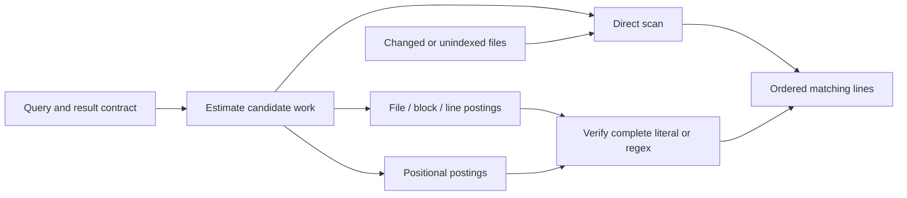

**Line search: content trigrams, selective verification, and choosing the right search path**

19 September 2026. **Yes: rarest-trigram filtering applies to line search. Index the contents, then verify matching lines.** The strongest design uses several search paths because index construction, query selectivity, result limits, updates and memory have different costs. No single algorithm can honestly be promised fastest for every workload.

Firecrawl CLI 1.23.3 was installed globally, authenticated using existing credentials, and verified with a successful scrape of Zoekt's design document. No Core or upstream Search implementation was changed; this work adds isolated experiments and this design.

**What the current Search implementation does**

In the supplied revision, `search_line_contents` uses the **filename** index to prioritize files, appends the remaining files, and scans their bodies. That filename ordering does not filter body matches. Replacing it with filename-only exclusion would introduce false negatives: `notes.txt` can contain `DatabaseConnection` without those characters appearing in its name.

The current content path also lowercases the query while matching original content bytes, reads complete files, and builds a full line-offset table before the larger-file search. A large file with fewer than 200 lines is read again by the sequential fallback. Outer file parallelism and inner chunk parallelism use Rayon tasks; they do not imply a new OS thread per task, but the extra subdivision has costs. Shared match-budget races can affect which files contribute results. Correct case semantics, I/O strategy and result ordering need to be settled before comparing implementations.

These findings refer to the inspected [Search source at fb1d7969](https://github.com/pleiades-org/Search/blob/fb1d7969450357955e23c344912c7856478716db/src/search.rs). It remains unchanged.

**How content filtering works**

For `database`, the byte trigrams include `dat`, `ata`, `tab`, `aba`, `bas`, and `ase`. An index maps these to candidate files, blocks, lines or positions. Start from the most selective useful posting, verify the complete literal, and return each matching line once. A missing required gram proves no exact match only when the relevant index is complete and current.

Document trigram filtering followed by exact verification is an established code-search design. Regex support needs conservative Boolean analysis: alternatives such as `foo|bar` cannot be filtered by requiring both branches. [Russ Cox's explanation of Google Code Search](https://swtch.com/~rsc/regexp/regexp4.html)

Positions go further. A posting stores occurrence offsets; a gram at query offset 4 and document offset 104 suggests a match beginning at 100. A second gram can be checked at its expected relative position before comparing the full literal. Zoekt documents this positional approach and selecting useful gram pairs. [Zoekt design](https://github.com/sourcegraph/zoekt/blob/main/doc/design.md)



**New measurements on actual project source**

I tested nine methods on **73 local Rust source files, 28,735 lines, 938,302 canonical UTF-8 bytes**, drawn from the existing Core and pinned Search trees. A second synthetic corpus contains **128 virtual files, 65,545 lines and 5,570,822 bytes**, with common text, Unicode, one rare marker and deliberately misleading gram combinations.

All variants share the same contract: byte-exact case-sensitive literals within one line; one result per matching line; document/line order; first 12 and all-results measured separately. CRLF is converted to LF during corpus preparation. Matching, candidate lookup, line identification and result IDs are timed; file reads, normalization, result text formatting, UI, updates and index construction are not included in query latency.

Three release-mode process runs, 32 warmups and 101 individually timed queries per case. Method order rotates across runs. Values below are medians of the three run medians on the Ryzen 7 7800X3D / Windows 26200 / Rust 1.95.0 machine used for the earlier experiments. The runs are not CPU-isolated; approximately 100 ns timer quantization means sub-microsecond cases should not be treated as precise nanosecond measurements. These corpora fit in memory and do not establish cold-SSD or very-large-corpus performance.

For the real-source query `normalize_search_text`, all methods returned the same **109 matching lines**:

| Method | Median |
| --- | ---: |
| Search each line separately with a reused literal finder | 227.8 µs |
| Search the contiguous buffer and locate matching lines | 23.4 µs |
| Rarest content gram → candidate files | 15.1 µs |
| Rarest content gram → 64-line blocks | 7.0 µs |
| Rarest content gram → candidate lines | **2.1 µs** |
| Intersect two rare line postings | 2.3 µs |
| Rarest positional gram, verify literal at candidate offset | 2.9 µs |
| Positional pair using a streaming merge | 2.9 µs |
| Positional pair using binary search for each candidate | 3.9 µs |

Here, line filtering was about **11× faster than the buffer scan**. The buffer scan itself was almost ten times faster than visiting every line separately. These are measured kernels with identical results, not a claim of beating ripgrep or the complete existing application.

**The rarest posting alone is not always enough**

The synthetic `abcd` fixture places `abc` and `bcd` on many separate lines, with only eight lines containing the full string. File and block postings admit much of the corpus because they discard positions and line boundaries.

| Method, all eight matches | Median |
| --- | ---: |
| Contiguous buffer scan | 114.0 µs |
| Rarest file posting | 112.3 µs |
| Rarest block posting | 121.5 µs |
| Rarest line posting | 108.3 µs |
| Intersect two line postings | **10.8 µs** |
| Rarest positional posting | 24.5 µs |
| Positional pair with binary searches | 76.4 µs |
| Positional pair with streaming merge | **9.1 µs** |

This is deliberately adversarial, not a representative average query. It demonstrates why both granularity and intersection implementation matter. The streaming merge improved this positional-pair prototype substantially; a much smaller first list and huge second list may instead favor galloping or binary searches. That crossover was not measured here.

The opposite case matters too. For the **first 12** synthetic `return` matches, line-rarest search finished below 1 µs, while eagerly materializing the entire two-list line intersection took **8.8 µs**. A lazy intersection could stop sooner and is a logical next refinement if that path is selected; it has not been benchmarked in this prototype. For the one rare body-only marker, a buffer scan took **104 µs**, file filtering **1.0 µs**, and block/line/position variants below 1 µs.

A common one-character query with a small result limit can be answered quickly by a direct scan. Three-byte grams cannot filter shorter patterns. Indexing and intersecting more data is not inherently faster than stopping after enough nearby matches.

**Index memory and build time change the recommendation**

The following are **additional requested live heap bytes for the index**, not process RAM. They exclude the common content buffer, common line metadata, allocator overhead, operating-system caches and UI. Posting IDs/offsets are uncompressed 32-bit integers; keys use the standard hash map. Line IDs directly identify lines, avoiding a redundant unit-range array. The block prototype groups 64 whole lines, not fixed-size disk blocks.

| Content index | Real source retained | Synthetic retained | Real source build | Synthetic build |
| --- | ---: | ---: | ---: | ---: |
| Per file | 1.22 MiB | 0.50 MiB | 14.82 ms | 40.56 ms |
| Per 64-line block | 1.82 MiB | 1.89 MiB | 15.89 ms | 42.46 ms |
| Per line | 3.23 MiB | 19.04 MiB | 17.40 ms | 57.98 ms |
| Per occurrence position | 4.06 MiB | 20.55 MiB | 17.21 ms | 57.72 ms |

Repetitive synthetic files and heterogeneous real source have very different index ratios. Do not extrapolate one ratio to an entire disk. The comparison harness retains competing indexes simultaneously; a production configuration should not automatically build all of them.

These are straightforward experimental layouts, not optimal compressed formats. Delta-coded or packed postings, narrower metadata, and a suitable representation for dense lists could reduce space, with decoding/build costs to measure. A line index creates many repeated line memberships; a positional index stores every gram occurrence. File granularity deduplicates much more aggressively. Precomputed common line spans also consume memory in this harness; a production line-offset table can be more compact.

Index building must be amortized. Using the synthetic rare-query figures as a simple model, a roughly 40.6 ms file-index build saves about 103 µs per query versus the resident buffer scan: approximately **400 such queries** to recover the build time. This calculation excludes I/O, updates and other queries and is not a cold-start benchmark. Building an index on demand for one search is usually the wrong path; prepare it in the background for repeatedly searched roots.

**Recommended adaptive design**

| Situation | Preferred starting path |
| --- | --- |
| One-off search, changed/unindexed content, or a small current buffer | Direct optimized scan; avoid waiting for an index build. |
| Repeated literal searches with a tight storage budget | Content file/block postings, selective verification; choose granularity using measured candidate bytes and an explicit index budget. |
| Hot source-code roots needing lower latency | Consider line postings. The real-source experiment supports them, but their memory grows substantially on the synthetic corpus. |
| Large files where document-level grams saturate; precise occurrence constraints | Positional postings, rare anchor plus optional second-gram distance check, complete verification. |
| Regex or many literals | Compile once per query. Extract only logically required literal constraints; otherwise scan with the appropriate matcher. A suffix-array backend is a research alternative for mostly static corpora. |

For the last row, direct scanning is a serious baseline: ripgrep documents literal/SIMD optimizations and choosing between buffered search and memory maps. A hand-built index is not automatically faster for an unindexed query. [ripgrep's implementation overview](https://github.com/BurntSushi/ripgrep#is-it-really-faster-than-everything-else)

Suffix arrays are a different way to find substring ranges; livegrep's author explains using them for code/regex search. They warrant a separate comparison for large, mostly static collections, including construction, updates, memory and result ordering. They were **not** benchmarked here. [livegrep's suffix-array design](https://blog.nelhage.com/2015/02/regular-expression-search-with-suffix-arrays/)

The planner should minimize estimated work, not always choose the posting with the fewest IDs:

```text
estimated cost = posting lookup/decode
               + candidate bytes to read or verify
               + line/result bookkeeping
               + output work
```

One candidate file can be larger than hundreds of other candidates combined. At file/block granularity, store useful byte-volume statistics alongside posting counts. Consider result limit, cache state and explicit path/type filters. Read an additional posting only when expected pruning is worth its cost. At occurrence granularity, use list sizes/density to choose direct verification, streaming merge or sparse-list lookup. Calibrate on held-out queries rather than hard-coding thresholds from this small corpus.

**Correctness and resource rules for implementation**

1. **Define the query contract.** Literal versus regex, case mode, Unicode/encoding policy, single-line versus multiline, first available versus ordered results versus globally ranked results. Searching all matches is a different amount of work from returning 12. Do not silently change the contract to claim a speedup.
2. **Keep indexes conservative and current.** Publish immutable versioned shards; track dirty/unindexed files and search them separately. A stale index must not suppress a newly inserted term. If common grams are deliberately omitted to save space, distinguish “omitted” from “known absent.” Coalesce change notifications and compact away obsolete shards outside the query path.
3. **Preserve boundaries and offsets.** Whole-line blocks need no overlap for single-line literals. Fixed byte chunks require boundary handling; arbitrary multiline regex cannot be made safe by assuming a small fixed overlap. Store stable file identity plus file-local offsets/line mapping. Case normalization that changes byte lengths needs original-offset mapping or matching over the original representation.
4. **Bound work and memory.** Use one bounded worker pool, choose useful work chunks by bytes, cancel stale queries, avoid eagerly reading every body, and delay path/snippet allocation until a result survives. A mapped/compressed index still consumes storage, page-cache memory and decoding work. Limit prefetch and old snapshot retention.
5. **Measure complete costs.** Track time to first usable result, ordered first 12, full enumeration, p50/p95/p99, candidate bytes, build/load time, update latency, index disk size, peak/private RAM and idle CPU. Include large individual files, many small files, broad/absent queries, dirty files, cold storage, Unicode and adversarial regex. The nine-method warm experiment does not cover those integration costs.

“Fastest in every situation” is not a testable universal guarantee. A practical target is a planner that stays close to the best eligible measured backend across a held-out workload suite while meeting explicit RAM and update budgets. The planner itself is not implemented or benchmarked yet.

For Core, content search remains outside the small initial launcher release. For the separate Search project, the next implementation work should establish a correct streaming baseline and content-index snapshot API, then integrate one storage-budgeted index and add other paths only where measurements justify them.

**Evidence and reproduction**

Run [run-line-search.ps1](C:/Users/Robert/code/Pleiades/Core/benchmarks/search-alternatives/run-line-search.ps1). It uses existing `memchr` 2.8.0 and no new production dependency. It reads the listed local source files only during setup; raw content is not copied into the report or sent to a service. The paths in the script can be changed for another machine.

See [raw/aggregate results](C:/Users/Robert/code/Pleiades/Core/benchmarks/search-alternatives/results/line-search/summary.csv), [environment and contract](C:/Users/Robert/code/Pleiades/Core/benchmarks/search-alternatives/results/line-search/environment.json), [source corpus hashes](C:/Users/Robert/code/Pleiades/Core/benchmarks/search-alternatives/results/line-search/corpus-hashes.csv), and [the benchmark entry point and tests](C:/Users/Robert/code/Pleiades/Core/benchmarks/search-alternatives/src/bin/line-search.rs). Initial eight-method results were preserved separately before adding the streaming positional merge and removing redundant line-index metadata.

All nine methods passed result-equivalence checks before every timed corpus run. Three dedicated tests cover limits, repeated hits on one line, CRLF, case/Unicode literals, false matches across lines, block boundaries and very long lines. Formatting and Clippy passed. Build allocations were measured in a separate instrumentation pass; the zero allocation fields on latency rows are unused placeholders, not evidence of allocation counts.
