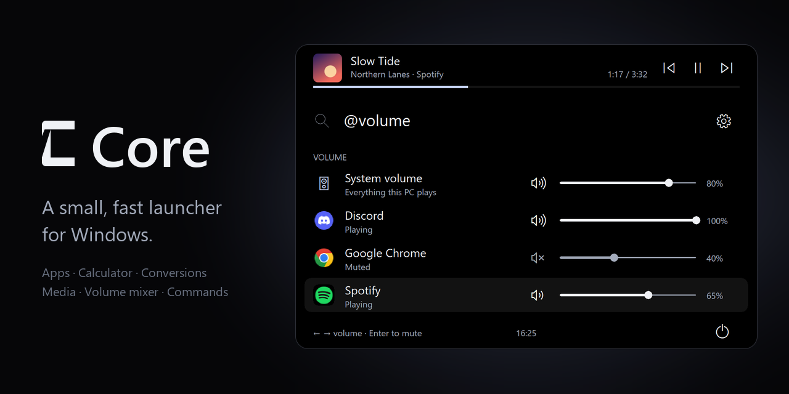

# Core

**A small, fast launcher for Windows.** Press a shortcut, type a few letters, press Enter.



Core opens your apps, does sums and conversions, runs commands, controls your music and sets each program's volume, all from one small window that gets out of the way when you are done. It is a single program of about 2 MB, written in Rust. It needs no account, and while it is hidden it sits idle: no timers and no polling.

**New in 2.7.0:** shuffle and repeat on the now-playing bar, `@album` and `@artist`, and smoother corners. See the [release notes](https://github.com/pleiades-org/Core/releases/latest).

## Install

1. Download **`Core-Setup-<version>.exe`** from the [latest release](https://github.com/pleiades-org/Core/releases/latest).
2. Run it and choose **Install**. Core installs for your Windows account only, so there is no administrator prompt.
3. Press **Ctrl+Alt+Space** to open Core.

Good to know:

- **"Windows protected your PC"** may appear the first time, because the setup file is not signed with a publisher certificate. Choose **More info**, then **Run anyway**.
- **Portable use:** download the ZIP from the same page instead and run `core-v2.exe` from any folder.
- **Requirements:** 64-bit Windows and the Microsoft Visual C++ runtime (x64), which most PCs already have.
- **Uninstall** from **Settings → Apps → Installed apps** in Windows. Your Core settings are kept.
- If Core is already running, exit it from its tray icon before installing or uninstalling.

## The basics

| Press | To |
| --- | --- |
| **Ctrl+Alt+Space** | Open or hide Core |
| **↑** **↓** | Move through the results |
| **Enter** | Open, copy or run the selected result |
| **Esc**, or a click elsewhere | Hide Core |
| **Ctrl+,** | Open Settings |
| **Ctrl+Backspace** | Delete the word before the caret |

- The line at the bottom of the window always says what Enter will do, such as **Enter to open** or **Enter to copy**.
- Open Core without typing and it shows the apps you used most recently, like the Start menu.
- Core lives in the system tray. Its icon's menu opens Core, opens Settings or exits.
- The shortcut can be changed in Settings, or set to the Windows key on its own.

## What you can type

Just type. Core works out whether you mean an app, a sum, a conversion or a time. Everything else is a command that starts with `@`; type `@` on its own to see them all.

### Apps, files and websites

| Type | What happens |
| --- | --- |
| `code`, `vsc`, `studio code` | Finds apps by name, by the start of any word, or by initials |
| `cmd`, `wt`, `taskmgr` | Finds apps by the short names Windows gives them |
| `> docs` | Opens one of your [quicklinks](#quicklinks) |
| `@web rust windows` | Searches Google in your browser |
| `@run notepad`, `shell:startup`, `%appdata%` | Opens anything the Windows Run box (Win+R) accepts |

### Sums, conversions and time

| Type | What you get |
| --- | --- |
| `2 + 3 * 4`, `sqrt(81)`, `25% of 80` | The answer. Enter copies it |
| `10 kg to lb`, `4.7GB to MiB`, `30 mpg to l/100km` | Unit conversions |
| `100 usd to eur`, `£50 in dollars` | Currency, at the European Central Bank's reference rates |
| `20% off 80`, `tip 15% on 80 split 4` | Discounts, tips and split bills |
| `255 to hex`, `#ff8800`, `unix now` | Number bases, colours and Unix time |
| `10 GB at 100 Mbps`, `5 km in 25 min` | Download times and running pace |
| `2 days from now`, `next Friday`, `2026-12-25 - 2026-09-21` | Dates, and the days between them |
| `9pm et to uk` | Time zones, with daylight saving handled |

There are more in [the full list](#the-full-list) below.

### Music and volume

| Type | What happens |
| --- | --- |
| `play`, `pause`, `next`, `previous` | Controls your music: Spotify, Apple Music, a browser tab and others |
| `shuffle`, `repeat` or `loop` | Turns the player's shuffle on or off, or moves its repeat on: everything, one track, off |
| `@media` | Shows what is playing, and every open player |
| `@volume` or `@mix` | A volume mixer: the whole PC and each program, with a slider and a mute button |
| `@song basorexia` | Searches Spotify and plays the song you choose. Optional: see [Spotify song search](#spotify-song-search) |
| `@album absolution`, `@artist muse` | Searches Spotify for an album or an artist and plays the one you choose. Needs the same Spotify connection |
| `@playlist`, `@playlist chill` | Lists your own Spotify playlists, or the ones whose name matches, and plays the one you choose. Needs the same Spotify connection |

While something plays, a bar above the search box shows the album art, the track's progress and previous, play and next buttons. Rest the pointer on the album art to get a volume slider for that player. Move it over the buttons or the time, and shuffle and repeat buttons take the time's place: a dot under one means it is on, and repeat steps through everything, one track and off. They appear for players that let Windows change these settings, such as Spotify.

In the mixer, **↑ ↓** choose a row, **← →** change its volume and **Enter** mutes it. You can also drag a slider or click a speaker.

### Commands and your PC

| Type | What happens |
| --- | --- |
| `/ipconfig /all` | Runs a command in Core's own terminal. **Ctrl+Enter** opens a terminal window instead, and **Ctrl+Shift+Enter** runs as administrator |
| `@power`, `sleep`, `restart`, `power off` | Power actions. Each asks you to confirm |
| `taskbar` | Shows the Windows taskbar when it is hidden |
| `@update` | Update status. Enter checks now and downloads a new version |
| `@info` | Core's version and what is new in it |

## Make it yours

Open Settings with **Ctrl+,**, the gear in Core's window, or the tray menu. Changes save by themselves.

### Aliases

Short names for things you type often. In **Settings → Aliases**, enter the alias and what it stands for:

| Alias | Stands for | So that |
| --- | --- | --- |
| `d` | `Discord` | `d` finds Discord |
| `@s` | `@song` | `@s basorexia` searches Spotify |
| `ip` | `/ipconfig /all` | `ip` becomes that command |

An alias replaces the first word you type and keeps the rest. Only a whole word counts, so `do` and `discord` still search as usual.

### Quicklinks

Save websites, files, folders and app links under a name in **Settings → Quicklinks**. Open one by typing its name, or type `>` to list them all.

| Link | Name |
| --- | --- |
| `https://github.com` | `GitHub` |
| `C:\Projects` | `Projects` |
| `steam://rungameid/2379780` | `My game` |

Website quicklinks show the site's icon, and files and folders show their Windows icon.

### Look and behaviour

- **Appearance:** any background colour, seven positions on the screen, corner rounding and distance from the screen edge.
- **Behaviour:** the shortcut that opens Core (or the Windows key on its own), which display it opens on, starting with Windows, and the shell that `/` commands run in.
- **Music:** which player Core prefers, the now-playing bar on or off, and media shortcuts that work in every app.

### Spotify song search

`@song`, `@album`, `@artist` and `@playlist` are optional and off by default. They play through your own Spotify Premium account, after a one-time setup:

1. Open [Spotify's developer dashboard](https://developer.spotify.com/dashboard) with your Premium account, create an app and select **Web API**.
2. In the app's settings, add this exact Redirect URI: `http://127.0.0.1:43821/callback`. Copy the **Client ID**. No client secret is needed.
3. You may also need to add yourself to the app: open its **User Management** tab and add your name and the email address of your Spotify account. Spotify refuses accounts that are not on that list.
4. In Core, open **Settings → Music → Spotify song search**, turn it on and paste the Client ID.
5. Click **Connect Spotify** and approve it in your browser.

Then type `@song` and a song or artist, choose a result and press Enter. The song plays on the Spotify device you are using, so keep Spotify open on this PC for it to appear as a device.

`@album` and `@artist` search Spotify the same way, as in `@album absolution` or `@artist muse`. Enter plays the album from its first song, or the artist's songs as Spotify orders them.

Type `@playlist` to see the playlists in your Spotify library, your own and the ones you follow. Keep typing to narrow them by name, as in `@playlist chill`, and press Enter to play the one you choose. If you connected Spotify before Core had playlists, Core asks you to click **Connect Spotify** once more, because listing playlists is a permission of its own.

A selected playlist, album or artist has two buttons beside it, shuffle and repeat. Pick a row with **↑** or **↓**, then press **→** to move onto a button and Enter to play it that way; **←** goes back to the row. Or click the button. While you are still typing, **←** and **→** move through your text as usual. These buttons are an experiment and may change.

The media controls, the now-playing bar and the volume mixer work without any of this.

## Updates

Core keeps itself up to date. When you open it, at most once a day, it checks GitHub for a new version, downloads it in the background and installs it the next time Core closes. To update straight away, type `@update` and press Enter.

Every update is signed, and Core installs nothing that is not signed with its own key. If a new version fails to start, Core puts the previous one back. You can change this to notify-only or off in **Settings → Behaviour → Updates**.

## Privacy

- Finding apps, sums, conversions and time zones never use the network.
- Core connects to the internet only for the things below, and only when you open it:
  - **Updates:** GitHub, at most once a day.
  - **Currency rates:** the European Central Bank's public rates file.
  - **Website quicklink icons:** Google's favicon service, which therefore sees the domain names of your website quicklinks. Addresses on your own network are never sent to it.
  - **Spotify**, only if you connect it, and only for `@song`, `@album` and `@artist` searches, your list of playlists, playback and cover pictures.
- There is no telemetry and no account. Your settings, history and log stay in `%APPDATA%\Pleiades\Core\v2` on your PC.

## Something not working?

- **Nothing happens when I press the shortcut.** Another program may already use Ctrl+Alt+Space. Open Core from its tray icon and choose another shortcut in **Settings → Behaviour**.
- **A newly installed app is not found.** Core reads the list of apps when it starts. Exit Core from the tray and open it again.
- **`@song` finds nothing or does not play.** It needs Spotify Premium, the one-time setup above, and Spotify open on a device. If Core says that Spotify refused access, add your Spotify account's email address under **User Management** in your Spotify app (step 3 of the setup).
- **Anything else.** Core writes problems to `%APPDATA%\Pleiades\Core\v2\core.log`. Please [open an issue](https://github.com/pleiades-org/Core/issues) saying what you typed and what happened.

## The full list

<details>
<summary>Everything Core understands</summary>

| Type | What happens |
| --- | --- |
| Nothing | Your recently used apps as a grid, up to 18. Arrow keys move, Enter or a click opens |
| `code`, `vsc`, `studio code`, `xbox` | Apps from the Start menu and the Microsoft Store, by name, word start, initials or any part of the name |
| `cmd`, `wt`, `taskmgr`, `regedit` | Apps by Windows' own short names: `cmd` finds Command Prompt and `wt` finds Windows Terminal |
| `@app calculator` | Apps only |
| `> docs`, `@quicklink docs` | Your quicklinks. Their names also appear in normal search |
| `2 + 3 * 4`, `@calc 25% of 80` | A sum. Enter copies the answer |
| `sqrt(81)`, `round(2.6)`, `pi*2` | Maths functions and constants |
| `time`, `date` | The time or date now. Enter copies it |
| `2 days from now`, `next Friday`, `3 hours ago` | Dates and times from today |
| `2028-01-31 + 1 month`, `2026-12-25 - 2026-09-21` | Date sums, and the days between two dates |
| `10 kg to lb`, `4.7GB to MiB`, `30 mpg to l/100km` | Units of 15 kinds, including data sizes and speeds |
| `100 usd to eur`, `£50 in dollars`, `100 usd` | Currency. An amount on its own converts to your own currency |
| `10 GB at 100 Mbps`, `10 GB in 10 min`, `100 Mbps for 2 hours` | Download time, the speed you need, and data used |
| `5 km in 25 min`, `26.2 mi in 3:30:00` | Running pace and speed |
| `20% off 80`, `20 is what % of 80`, `% change from 50 to 75` | Percentages |
| `tip 15% on 80 split 4`, `split 120 3 ways` | Tips and split bills |
| `255 to hex`, `0xff`, `2024 to roman` | Number bases and Roman numerals |
| `#ff8800`, `rgb(255, 136, 0) to hex`, `hsl 210 50 40 to rgb` | Colours as HEX, RGB and HSL |
| `unix now`, `unix 1700000000` | Unix time |
| `1920x1080`, `ppi 2560x1440 27in` | Screen aspect ratio and pixel density |
| `mortgage 250k at 4.5% for 25 years`, `compound 1000 at 5% for 10 years` | Loan payments and savings growth |
| `bmi 70kg 175cm` | Body mass index |
| `9pm et to uk`, `@time 21:00 ET to UK` | Time zones: ET, CT, MT, PT, UK, Berlin, Sydney, Tokyo, India and UTC |
| `9pm et to uk on 2026-03-10` | Time zones on a particular date |
| `@web Rust & Windows` | A Google search in your browser |
| `@`, `@cal` | Lists or completes a command |
| `@power`, `power off`, `restart`, `sleep` | Power actions, each confirmed first |
| `/ipconfig /all` | A command in your shell. **↑** recalls earlier commands |
| `@cmd dir`, `@ps Get-Process`, `@pwsh …`, `@wsl ls`, `@bash ls` | A command in a particular shell |
| `@run notepad`, `shell:startup`, `ms-settings:display`, `%appdata%` | Anything Windows Run accepts, optionally as administrator |
| `taskbar`, `tb`, `@taskbar` | Shows the Windows taskbar on Core's display |
| `@media`, `@music`, `@media spotify next` | Media controls, for the chosen player or one you name |
| `play`, `pause`, `next`, `previous`, `now playing` | That media control straight away. Core stays open for another press |
| `shuffle`, `repeat`, `loop`, `@media spotify shuffle` | Shuffle on or off, or repeat's next setting, for a player that lets Windows change them |
| `@volume`, `@mix`, `@mix spot` | The volume mixer, or only the programs whose name matches |
| `@song basorexia` | Spotify song search, once connected |
| `@album absolution`, `@artist muse` | Spotify album and artist search. Enter plays the chosen one; after **↑** or **↓**, **→** then Enter plays it shuffled or on repeat |
| `@playlist`, `@playlists`, `@playlist chill` | Your Spotify playlists, narrowed by what you type. Enter plays the chosen one; after **↑** or **↓**, **→** then Enter plays it shuffled or on repeat |
| `@update` | Checks for and installs updates |
| `@info`, `@about`, `@version` | Core's version, the latest release and this version's release notes |

Sums follow the usual order: `2+3*4` is 14 and `(2+3)*4` is 20. `%` divides by 100, so `25% of 80` is 20 and `20 + 10%` is 20.1.

</details>

## Build it yourself

Core is two Rust crates: `crates/engine` (search, the calculator and conversions, with no dependencies) and `crates/launcher` (the native Windows window).

You need Windows, the Rust MSVC toolchain (its version is pinned in `rust-toolchain.toml`) and the Visual Studio C++ build tools.

```powershell
cargo build --release --locked -p core-launcher-v2 --bin core-v2
cargo test --locked --workspace
cargo clippy --locked --workspace --all-targets -- -D warnings
```

The result is `target\release\core-v2.exe`. Start it with `--dry-run` to try it without it opening apps, writing to the clipboard or registering shortcuts.

The scripts in `scripts\` run the release checks and build the release package. The checks open Core's windows on screen, and they keep their records in a `docs\measurements` folder that is not part of this repository: create it before running them.

## Status

Core is young and still changing. Known gaps:

- Newly installed apps are found after Core restarts.
- Typing mistakes are not corrected yet.
- The setup file has no publisher certificate, so Windows warns about it the first time.
- Screen readers, mixed display scaling and some input methods are not covered by the automated checks.
