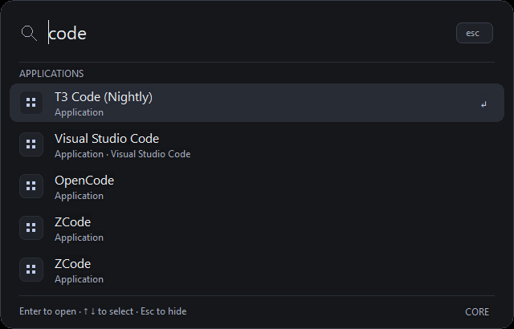
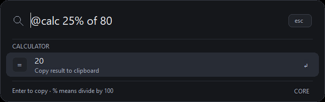

# Styling update — 20 September 2026

**OLED follow-up:** the current palette uses `#000000` for the background and surfaces, and `#121212` for the selected row. All window, card, icon-tile and Esc-button outlines have been removed, along with header/footer dividers. Rounded geometry and motion are preserved. Release SHA-256: `DB307156E11BC5119F3C8B59311F24D0953132A1CE962E8D60AD987248A419C1`. Strict Clippy, release build and the existing styling checks pass; screenshot pixel checks confirm pure black at the background, window edges and former divider positions. See `measurements/oled-styling-checks.json`, `measurements/oled-pixels.json` and `measurements/oled-apps.bmp`. Measurements and screenshots below describe the preceding charcoal build.

The launcher now uses a compact dark palette with 16-DIP outer corners, softly rounded selected rows, a subtle border, small action icons, secondary descriptions and a clickable Esc button. A single-result calculator shrinks to 640 × 202 DIPs; the palette grows with the visible results. Fonts, spacing, rows and corner geometry scale with DPI. The existing native edit and list controls still hold the text and selections.

Entrance fades take 130 ms and exit fades take 100 ms, using a cubic ease-out curve. Transitions are nonblocking and can reverse from the current opacity. Their timer runs only during the fade and is killed on completion. Per the user's preference, Core animates independently of the disabled Windows animation setting. `--reduced-motion` disables Core's fades; `--system-motion` follows the OS preference. Windows settings are not modified.

The implementation separates theme values and font resources (`theme.rs`), drawing (`painting.rs`), layout and native controls (`view.rs`), and transitions (`motion.rs`). A read-only view reference lets Windows owner-draw callbacks run during UI state updates without taking the search-state borrow. Layout and window-region work are skipped when DPI and result count have not changed. The common-controls manifest enables native cue text and current Windows control behavior. No new library dependency or rendering framework was added.

## Verification

- All 13 Rust tests, formatting and strict Clippy checks pass.
- Existing Windows search, command, rapid-edit/Enter, tray-menu and shutdown integration checks pass.
- Styling checks validate the rounded window region, compact and expanded geometry, native keyboard selection and clickable hide button.
- Both enabled and disabled animation paths pass. Enabled tests observe intermediate opacity on entrance and exit; 20 interrupted/reversed cycles finish correctly. GDI object count remains **19 before and 19 after** the warmed cycle test. Initial control setup has five objects before the first display; the increase to 19 occurs during warm-up, not on each cycle.
- The home, app results and calculator were captured from Core's own window and visually inspected. Mixed-monitor DPI, IME candidate windows and assistive technology still need broader acceptance testing.

## Resource observation

Release executable: **459,264 bytes (448.5 KiB)**. SHA-256: `F53F31D90D415F239777D9D5CBC3C791379F4E71B178AB4D38F95409E6BD564E`.

The 60.75-second sample after a completed show/hide cycle, with 294 actual Start Menu targets, ended at **2,510,848 private bytes (2.39 MiB)** and **14,970,880 working-set bytes (14.28 MiB)**. It accumulated zero CPU time at the process counter's resolution. This is a short observation, not a guarantee of permanently zero CPU or a rerun of all release gates. The test process used `--dry-run`, which disables external actions and renders search results while hidden. GPU memory and presented-frame timing were not measured.

The previous 2.07 MiB private-memory observation was a different build measured without the same display warm-up; do not treat the difference as an isolated cost of styling.

Raw evidence: `measurements/styling-checks.json`, `measurements/styling-reduced-motion.json`, `measurements/styled-integration.json`, and `measurements/native-styled-hidden-60s.json`.

```powershell
.\scripts\test-styling.ps1
.\scripts\test-styling.ps1 -ReducedMotion -Label styling-reduced-motion
.\scripts\measure-resources.ps1 -DurationSeconds 60 -Label native-styled-repeat -WarmWindow
```




